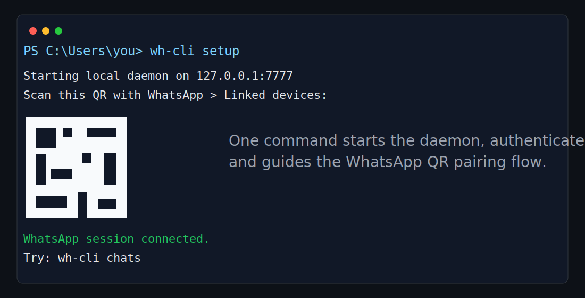
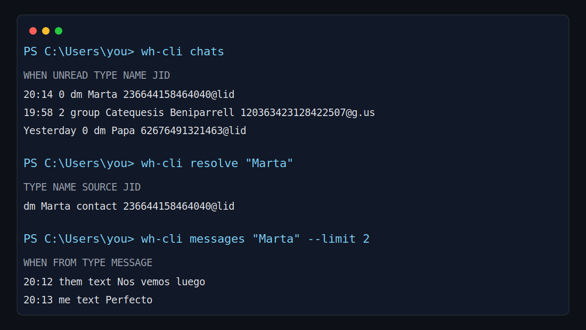

<p align="center">
  
</p>

<h1 align="center">wh-cli</h1>

<p align="center">
  Local WhatsApp CLI and API for humans, scripts and AI agents.
</p>

<p align="center">
  <a href="https://github.com/l-i408/wh-cli/actions/workflows/ci.yml"></a>
  <a href="https://github.com/l-i408/wh-cli/releases/latest"></a>
  <a href="LICENSE"></a>
</p>

`wh-cli` links your WhatsApp account through the standard multi-device QR flow, runs a localhost-only daemon, and exposes a practical command line plus a REST/WebSocket API. It is designed so a person can use WhatsApp from a terminal and an agent can resolve contacts, read recent context and send messages without scraping WhatsApp Web.

> This project is not affiliated with WhatsApp or Meta. Use it responsibly and follow WhatsApp's terms.

## Screenshots





## What It Does

- Runs a local WhatsApp daemon bound to `127.0.0.1` by default.
- Provides CLI commands for setup, QR pairing, chats, messages, contacts, groups, sending, media, devices and event streaming.
- Lets commands accept human names such as `"Marta"` or `"Family"` instead of forcing raw WhatsApp JIDs.
- Prints clean tables by default and raw JSON with `--json` for agents and automation.
- Stores local state in SQLite and keeps tokens/secrets in the OS keyring.
- Exposes REST endpoints and a WebSocket event stream for advanced integrations.

## Install

Download the latest binary from the GitHub release page:

https://github.com/l-i408/wh-cli/releases/latest

Choose the archive for your platform:

| Platform | Asset |
| --- | --- |
| Windows x64 | `wh-cli_0.1.0_windows_amd64.zip` |
| Windows ARM64 | `wh-cli_0.1.0_windows_arm64.zip` |
| macOS Intel | `wh-cli_0.1.0_darwin_amd64.tar.gz` |
| macOS Apple Silicon | `wh-cli_0.1.0_darwin_arm64.tar.gz` |
| Linux x64 | `wh-cli_0.1.0_linux_amd64.tar.gz` |
| Linux ARM64 | `wh-cli_0.1.0_linux_arm64.tar.gz` |

### Windows

Extract the zip, open PowerShell in that folder and run:

```powershell
.\wh-cli.exe install
```

Open a new terminal, then verify:

```powershell
wh-cli help
```

The installer copies the binary to `%LOCALAPPDATA%\Programs\wh-cli` and adds that directory to the user `PATH`.

### macOS and Linux

Extract the archive, move the binary to a directory in your `PATH`, then verify:

```bash
chmod +x wh-cli
sudo mv wh-cli /usr/local/bin/wh-cli
wh-cli help
```

### Verify Downloads

Each release includes `checksums.txt` and `checksums.txt.sig`.

```bash
sha256sum -c checksums.txt
```

## Quick Start

Run the guided setup:

```powershell
wh-cli setup
```

`setup` starts or checks the local daemon, authenticates the local CLI and shows the QR code if the WhatsApp session is not connected yet.

After scanning the QR with WhatsApp > Linked devices:

```powershell
wh-cli status
wh-cli chats
wh-cli messages "Marta" --limit 20
wh-cli send "Marta" "Hola desde wh-cli"
```

## Command Overview

| Command | Purpose |
| --- | --- |
| `wh-cli help` | Show all available commands. |
| `wh-cli install` | Install the current binary locally and update PATH on Windows. |
| `wh-cli setup` | Start/check the daemon, authenticate the CLI and show QR if needed. |
| `wh-cli daemon` | Run the local WhatsApp/API daemon. Usually started by `setup`. |
| `wh-cli status` | Show the WhatsApp session state. |
| `wh-cli qr` | Render or export the pairing QR. |
| `wh-cli chats` | List recent chats in a readable table. |
| `wh-cli resolve <name>` | Resolve a contact, chat or group name to its JID. |
| `wh-cli messages <name-or-jid>` | Show messages from a chat. |
| `wh-cli send <name-or-jid> <text>` | Send a text message. |
| `wh-cli send <name-or-jid> --file <path>` | Send a file or image. |
| `wh-cli send <name-or-jid> --audio <path>` | Send audio. |
| `wh-cli contacts` | List known contacts. |
| `wh-cli contact alias <jid> <alias>` | Set a local alias for name resolution. |
| `wh-cli groups` | List known groups. |
| `wh-cli group participants <group>` | List participants from a group. |
| `wh-cli react <chat> <message_id> <emoji>` | React to a message. |
| `wh-cli reply <chat> <message_id> <text>` | Reply to a message. |
| `wh-cli forward <message_id> <target>` | Forward a message. |
| `wh-cli watch` | Stream daemon events as JSON lines. |
| `wh-cli devices` | List linked devices. |
| `wh-cli devices revoke <jid>` | Revoke a linked device. |
| `wh-cli export --out <file>` | Export an encrypted local backup. |
| `wh-cli import --in <file>` | Validate an encrypted backup for import. |
| `wh-cli rotate-jwt-secret` | Rotate the local daemon JWT secret. |
| `wh-cli wipe` | Permanently delete local wh-cli data and session. |

Use `--json` on list/read commands when integrating with scripts or agents.

## Working With Names

Most commands accept either a raw WhatsApp JID or a human-readable name:

```powershell
wh-cli resolve "Marta"
wh-cli messages "Family"
wh-cli send "Papa" "Llegare en 10 minutos"
```

If a name is ambiguous, `wh-cli` exits with a clear error and prints candidates. If the name does not exist, it suggests possible contacts or groups. Agents should call `resolve --json` first when they need a stable target.

```powershell
wh-cli resolve "Mar"
wh-cli resolve "Marta" --json
```

## For AI Agents

Recommended agent flow:

```powershell
wh-cli resolve "Target name" --json
wh-cli messages "Target name" --limit 50 --json
wh-cli send "Target name" "message"
wh-cli watch
```

Design rules for agents:

- Prefer names for user-facing commands.
- Use `resolve --json` when a durable JID is needed.
- If `resolve` returns candidates, ask the user to choose instead of guessing.
- Use `messages --json` for context and `watch` for real-time incoming events.

See [docs/agents.md](docs/agents.md) and [api/openapi.yaml](api/openapi.yaml).

## Architecture

```text
WhatsApp multi-device
        |
        v
wh-cli daemon  <---->  SQLite + OS keyring
        |
        +-- CLI commands
        +-- REST API on 127.0.0.1
        +-- WebSocket events
```

The daemon owns the WhatsApp connection and local persistence. CLI commands authenticate locally, call the daemon API and render either tables or JSON. By default nothing is exposed outside localhost.

More detail:

- [docs/architecture.md](docs/architecture.md)
- [docs/api-contract.md](docs/api-contract.md)
- [docs/db-schema.md](docs/db-schema.md)
- [docs/security.md](docs/security.md)
- [docs/threat-model.md](docs/threat-model.md)

## Security Model

- The daemon binds to `127.0.0.1` by default.
- Access tokens and master secrets are stored through the OS keyring.
- Runtime data stays local to the machine.
- Databases, sessions, logs, QR images, message bodies and real WhatsApp identifiers must never be committed.
- Destructive operations such as `wipe` require explicit confirmation.

Read [SECURITY.md](SECURITY.md) before exposing the daemon beyond localhost or handling sensitive accounts.

## Production Scope

The production surface is CLI + daemon + REST/WebSocket API.

Normal user flow:

```powershell
wh-cli setup
wh-cli status
wh-cli chats
wh-cli resolve "Name"
wh-cli messages "Name"
wh-cli send "Name" "Message"
```

Operational/admin commands such as `daemon`, `export`, `import`, `rotate-jwt-secret`, `devices revoke` and `wipe` are available for local management and recovery.

## Build From Source

Source builds are intended for contributors. End users should install from the release assets above.

```powershell
git clone https://github.com/l-i408/wh-cli
cd wh-cli
make build
.\bin\wh-cli.exe install
```

Development checks:

```powershell
make test
make lint
make ci
```

## Release

Current public release: [v0.1.0](https://github.com/l-i408/wh-cli/releases/tag/v0.1.0).

Releases are built by GitHub Actions with GoReleaser for Windows, Linux and macOS. Checksums are published with every release.

## License

MIT. See [LICENSE](LICENSE).
