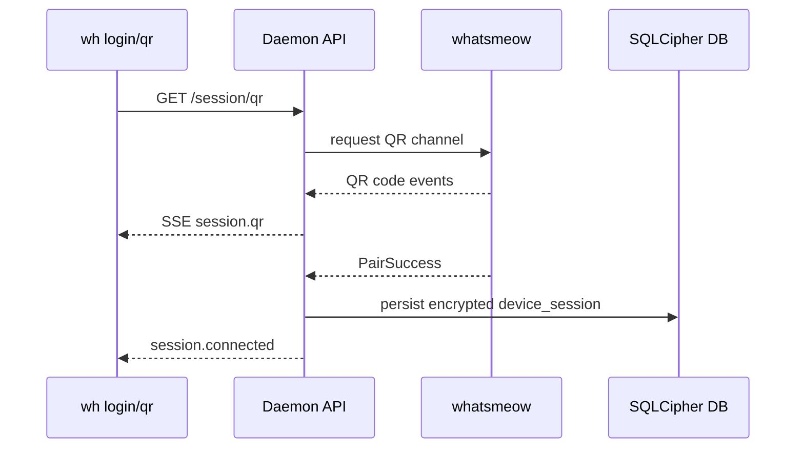
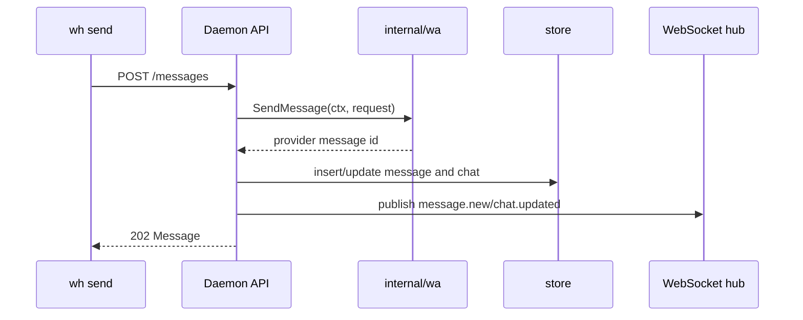
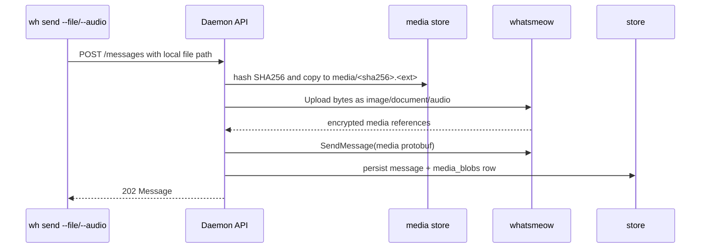
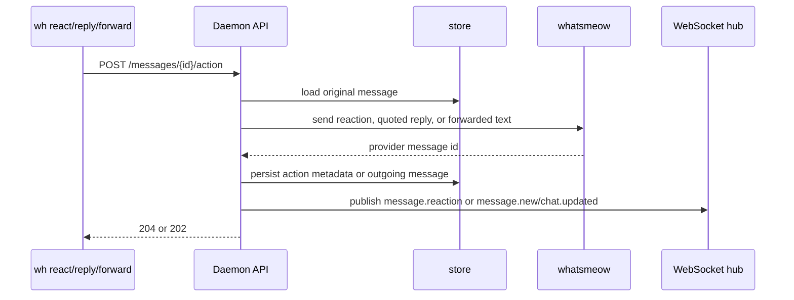
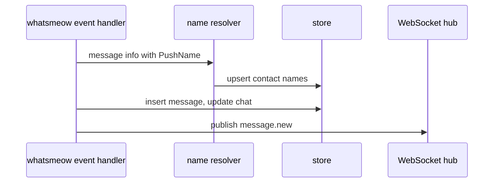
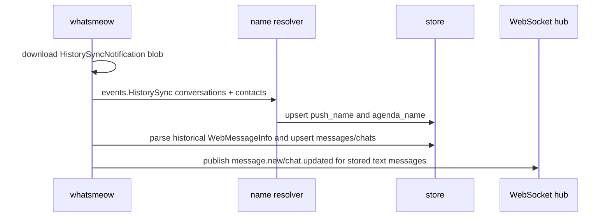
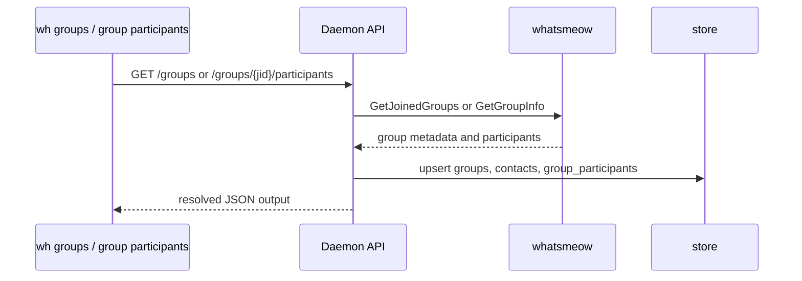

# Architecture

`wh-cli` is a local-first WhatsApp automation daemon. The daemon owns the WhatsApp connection, encrypted storage, authentication, REST API, and WebSocket event stream. Human UI and automation clients are separate clients of the same API.

## Components

- `cmd/wh-cli`: daemon entrypoint and non-interactive CLI commands.
- `internal/api`: local HTTP handlers and middleware.
- `internal/ws`: event hub for typed WebSocket events.
- `internal/wa`: wrapper around `whatsmeow`; this boundary is mocked in tests.
- `internal/store`: SQLite/SQLCipher persistence and repositories.
- `internal/auth`: passphrase, JWT, refresh-token rotation, and token repository.
- `internal/keyring`: OS keyring integration for master key and JWT secret.
- `internal/crypto`: KDF, SQLCipher opening/rekey, encrypted export/import, and wipe helpers.

## A1 Status

The current A1 implementation has the local auth pipeline in place: JWT signing, `jti` persistence, refresh rotation, protected logout, OS keyring token storage for CLI tokens, and a memory-backed WhatsApp session placeholder. The placeholder exposes `logged_out` and `qr_pending` states so API and CLI flows can be tested before the real `whatsmeow` QR client is wired behind the same interface.

## Login QR Sequence

## Send Message Sequence

## Send Media Sequence

Media sending is intentionally daemon-local in A3: the CLI passes a local path and the daemon reads it from the same machine. The stored copy is content-addressed by SHA256 so repeated sends of the same file reuse the same local blob.

## Message Action Sequence

A4 actions are intentionally anchored to the local message store. This avoids asking agents to reconstruct WhatsApp message keys themselves and keeps the CLI/API surface stable for humans and automation.

## Receive Message Sequence

The resolver keeps `PushName` fresh from inbound message metadata, stores address-book names from contact/history sync as `agenda_name`, and computes display names as `alias > agenda_name > push_name > formatted jid`.

## History Sync Sequence

History sync is handled through whatsmeow's `events.HistorySync` event. The daemon parses each historical `WebMessageInfo` with whatsmeow's own parser so sender/chat semantics match live message events, then stores supported text messages through the same message sink used for realtime messages.

When a client asks for messages and the local store has an oldest message anchor, the daemon sends whatsmeow's history-sync-on-demand request to the primary device for older messages. If there is no local anchor, the daemon sends a bounded full-history-on-demand request for the configured 3650-day window and stores the resulting `events.HistorySync` payload when WhatsApp returns it.

## Group Refresh Sequence

Group and contact reads use the same resolver priority everywhere. Manual aliases are stored in `contacts.alias`, agenda names are populated from contact/history sync, PushNames are refreshed from inbound messages, and group participants get a formatted fallback when WhatsApp has not exposed a better name yet.
